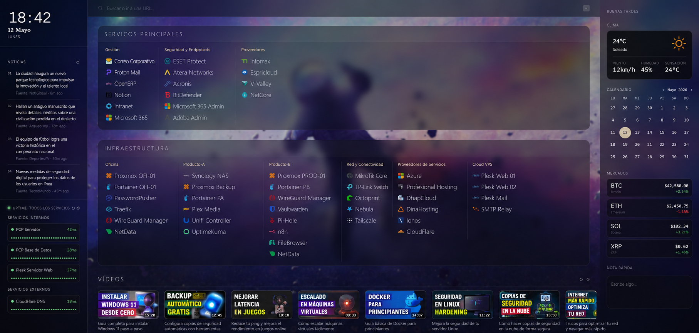

[🇪🇸 Versión en español](README.md)

# My Dashboard — New Tab for Firefox

**My Dashboard** replaces Firefox's new tab with a personal, minimalist, and fully customizable dashboard. Everything runs in the browser — no servers, no accounts, no API keys required.

Available on the **Firefox Add-ons Store**:
**https://addons.mozilla.org/es-ES/firefox/addon/newtab-dashboard/**



---

## What's included

The dashboard is split into three columns:

**Left column — Sidebar**
- Real-time clock and date
- RSS feeds with tabs per source (Hacker News, The Verge, Ars Technica, and any other feed)
- Service monitor via **Uptime Kuma** (global status + monitor grid)

**Center column — Main**
- Search bar with 8 configurable engines (Google, DuckDuckGo, Brave, Kagi, Perplexity…)
- Links organized as **Sections → Groups → Links** with automatic icons
- Latest videos from YouTube channels (no Google API key needed)

**Right column — Panel**
- Real-time weather via Open-Meteo (no API key)
- Monthly calendar with navigation
- Real-time cryptocurrency prices via CoinGecko (no API key)
- Persistent notepad

---

## Key features

- **No API keys** — Weather, crypto, and YouTube videos work without registration
- **Firefox Sync** — Settings sync automatically across devices
- **Automatic icons** — Links suggest their icon from Simple Icons as you type the name
- **Customizable wallpaper** — Image URL or preset gradient, with opacity, blur, dim, and tint controls
- **Import / Export** — Save and restore your full configuration as a JSON file
- **Multilanguage** — Interface available in Spanish and English
- **No dependencies** — Vanilla JS, no frameworks or bundler

---

## Installation

### From the store (recommended)

Install directly from the Firefox Add-ons Store:
https://addons.mozilla.org/es-ES/firefox/addon/newtab-dashboard/

### Developer mode (from source)

1. Clone or download this repository.
2. Open Firefox and go to `about:debugging`.
3. Click **"This Firefox"** → **"Load Temporary Add-on..."**.
4. Select the `manifest.json` file from the project folder.

> Temporary extensions are disabled when Firefox closes. For a permanent installation, use the store.

---

## Files

```
newtab-dashboard/
├── manifest.json      — extension configuration (Manifest v2)
├── dashboard.html     — dashboard structure
├── dashboard.css      — styles (glassmorphism, CSS variables, wallpaper)
├── dashboard.js       — all logic (~2,300 lines, Vanilla JS)
├── background.js      — reserved for future use
├── icon.svg / icon48.png / icon128.png
└── README.md
```

---

## Customization

All configuration is done through the **⚙** button in the UI — no code editing needed:

- Add / reorder / delete sections, groups, and links
- Manage RSS feeds (with popular presets)
- Add crypto assets (with presets)
- Add YouTube channels by Channel ID or @handle
- Change the default search engine
- Apply a wallpaper (URL or gradient) and adjust its effects
- Switch the interface language
- Export and import the full configuration

To change the weather city, edit the coordinates in `dashboard.js` (search for `open-meteo.com`).

---

## Tech stack

| Layer | Details |
|---|---|
| Storage | `browser.storage.sync` (Firefox Sync) with `localStorage` fallback |
| Weather | [Open-Meteo](https://open-meteo.com/) — free, no API key |
| Crypto | [CoinGecko API](https://www.coingecko.com/en/api) — free, no API key |
| YouTube | Direct Atom XML feed — no Google API key |
| RSS | CORS proxy [rss2json](https://rss2json.com/) |
| Icons | [Simple Icons](https://simpleicons.org/) CDN + favicon fallback |
| Uptime | [Uptime Kuma](https://github.com/louislam/uptime-kuma) public Status Page |
